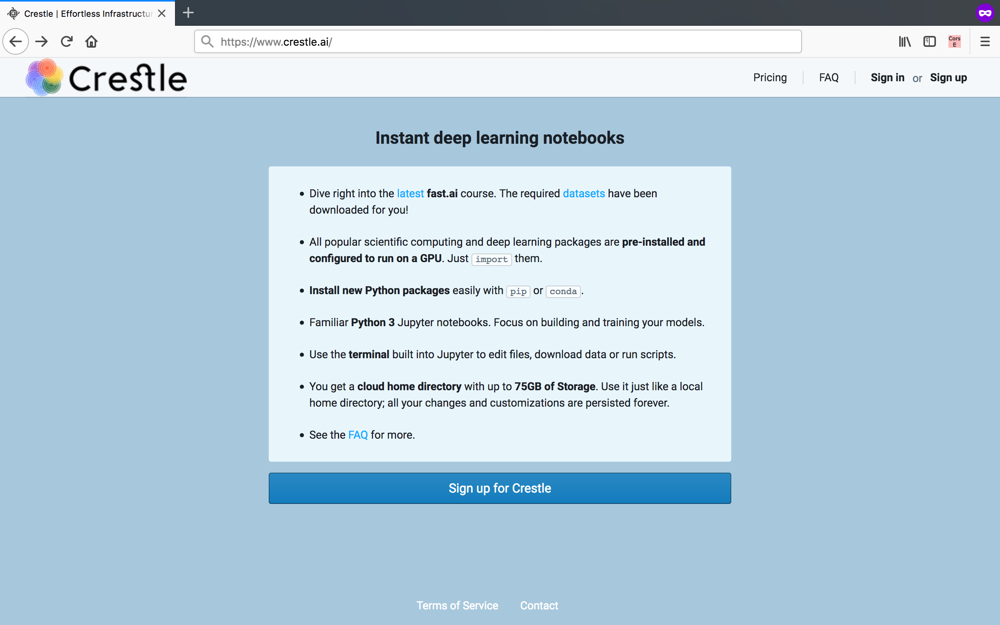
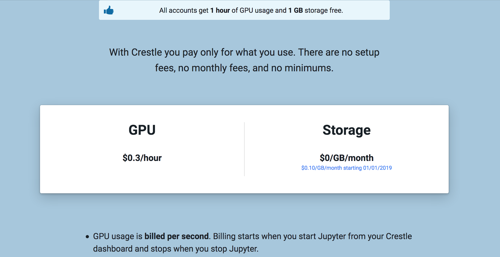
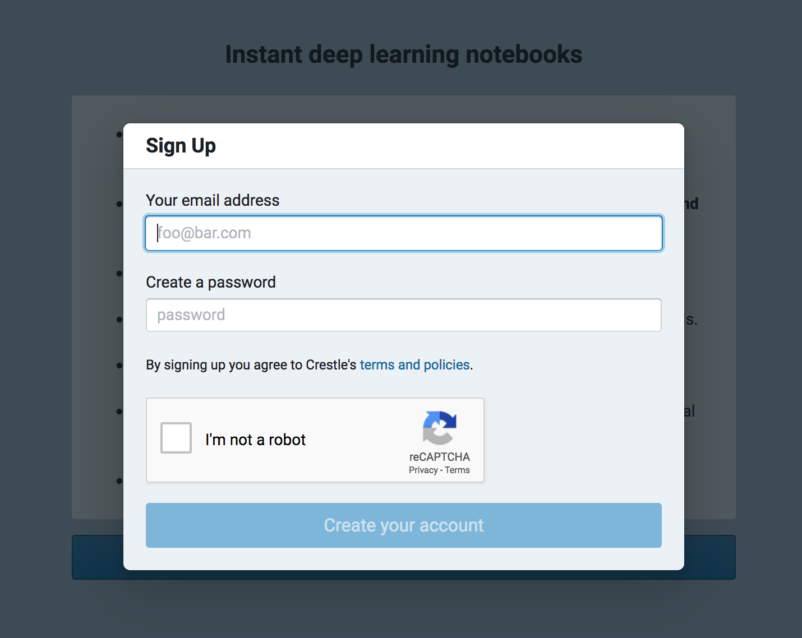
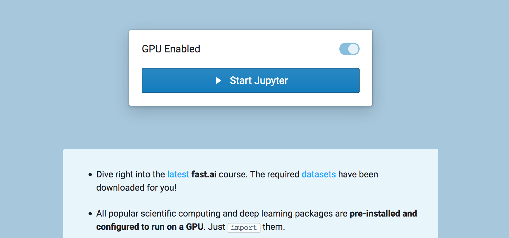
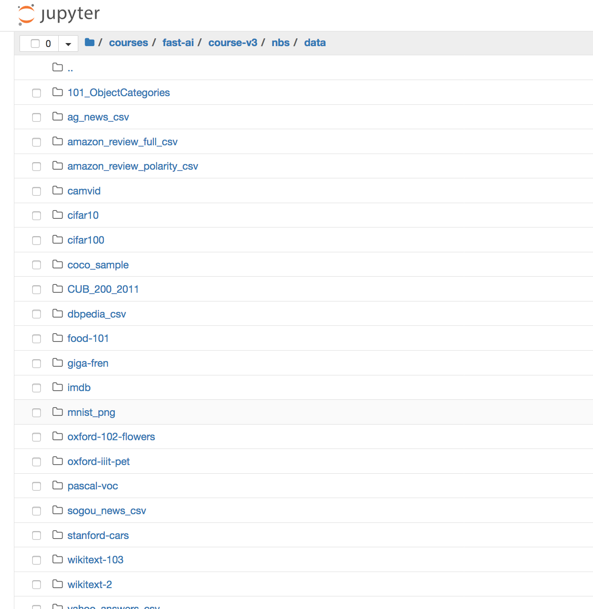
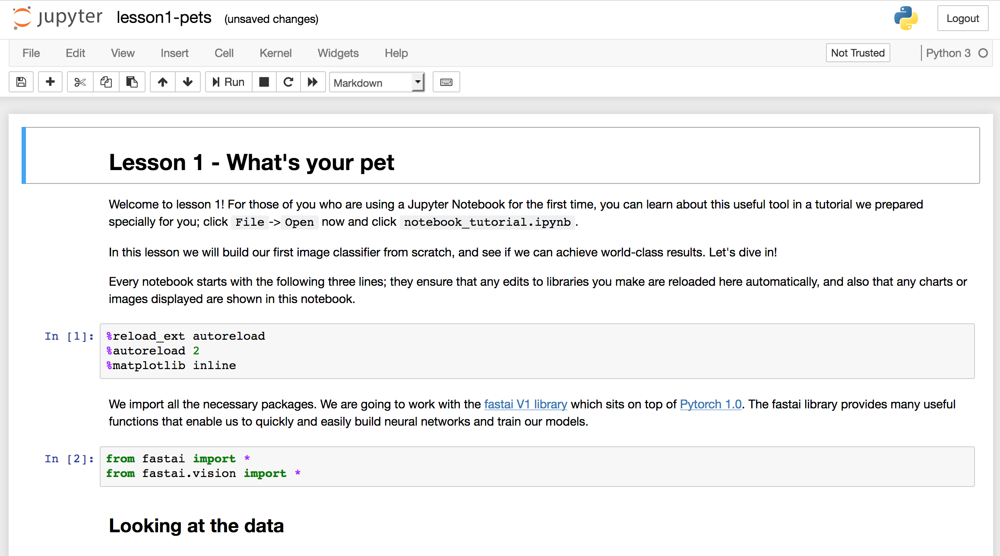

---

title: Crestle.ai
keywords: neuralnets deeplearning
sidebar: home_sidebar

---
# Welcome to Crestle.ai!


[Crestle.ai](https://www.crestle.ai/) provides effortless infrastructure for deep learning. Once you sign up you should be able to spin up a GPU enabled Jupyter notebook within a minute. There is no setup required on your part.

## Using crestle.ai for fast.ai v3 course

crestle.ai comes with the fast.ai course setup, including all the datasets (~35 GB) required as part of the course. Just dive right into the relevant notebook and start training!


## Pricing

Crestle uses AWS [p2.xlarge _spot_](https://aws.amazon.com/ec2/instance-types/p2/) instances to provision GPU instances. Using spot instances allows us to keep costs low. We are hosted in multiple AWS regions, thus providing a better guarantee on availability of instances.
Every GPU-enabled notebook is backed by a dedicated [NVIDIA Tesla K80 GPU](https://www.nvidia.com/en-us/data-center/tesla-k80/).

Our goal is to keep costs as low as possible for students and fast.ai practitioners. At the time of this writing we are charging:

- K80 GPU instance: $0.30 per hour, billed per second
- Storage: $0 (upto 75 GB) until 12/31/2018, after which it will be $0.10/GB/month.

You also get 1 hour of free GPU usage when you sign up.



## Getting started

### Step 1: Create a crestle.ai account
Sign up for Crestle [here](https://www.crestle.ai/). Verify your email by clicking on the link Crestle emails you. Once you have verified, you can sing in to your account.



### Step 2: Start your Jupyter notebook
Once you login you can start your Jupyter notebook with a press of a button. You will not be billed until you start your Jupyter notebook.



### Step 3: Navigate to fast.ai course
Once you start the notebook your GPU instance should be ready within a minute. We have already setup fast.ai for you. The directory structure available for you out of the box is as below:

```
- courses
     - fast-ai
        - course-v3
```


### Step 4: The datasets are already there - start coding!

We have already mounted the [datasets](http://course.fast.ai/datasets) required for this course. You don't have to download them. This is about 35 GB worth of data ready for you to train your models on.



You can navigate into the relevant notebook and start building.



### Step 5: Stop the instance when you are done

You need to **stop the instance** when you are done. This ensures you are *only* charged for time spent training or coding. The stop button is located at the top. You will be able to start your Jupyter instance as described in Step 2 at any time.

Shutting down your instance will backup and snapshot the data from your home directory and will be available for you the next time you launch the instance.


## What is installed?

crestle.ai has provisioned a [full Anaconda 5.3.0 environment](https://repo.anaconda.com/archive/) which bundles all the popular scientific packages.

Additonally we have also setup the fast.ai environment as described [here](https://github.com/fastai/fastai#conda-install) which includes Pytorch with GPU support and fastai library as well.

You can open the Terminal from Jupyter notebook and install additional libraries using `conda install` or even `pip install` which will install this on your home directory and will be backed up for you when you shutdown your instance.


## Storage and Data

crestle.ai provides you with 75GB worth of storage on a single volume. Please note that about 37GB of this is already taken up by the fast.ai datasets, anaconda and its dependencies.

You have complete read/write access to your volume. Your home directory, `/home/nbuser`, contains the courses directory and anaconda install directory (hidden directory).

Anything you add to your home directory will be backed up for you at no additional cost.


## FAQs

### How is this different from crestle.com?

crestle.ai is a new version of crestle.com which was previously setup for fast.ai course. With crestle.ai we have optimized the setup to run the latest fast.ai v3 course. We have also made it much faster by moving away from EFS setup and have significantly reduced the price!


### Where can I get support?

Just send an email to support@crestle.com - we are happy to help.


### Who is behind Crestle?

crestle.com was created by [Anurag Goel](https://twitter.com/anuraggoel) and is now being supported and managed by [doc.ai](https://doc.ai/).

### Where can I learn more about Crestle?

Please read our [FAQ](https://www.crestle.ai/faq). Our pricing information is listed [here](https://www.crestle.ai/pricing). You can always reach out to us at support@crestle.com.
