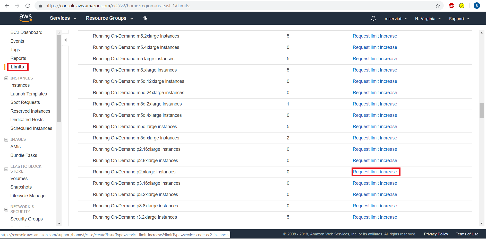
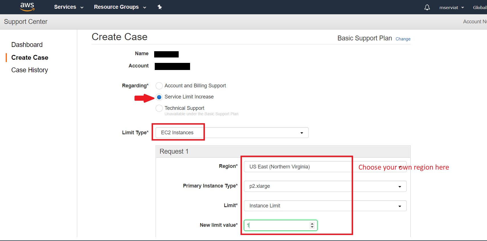
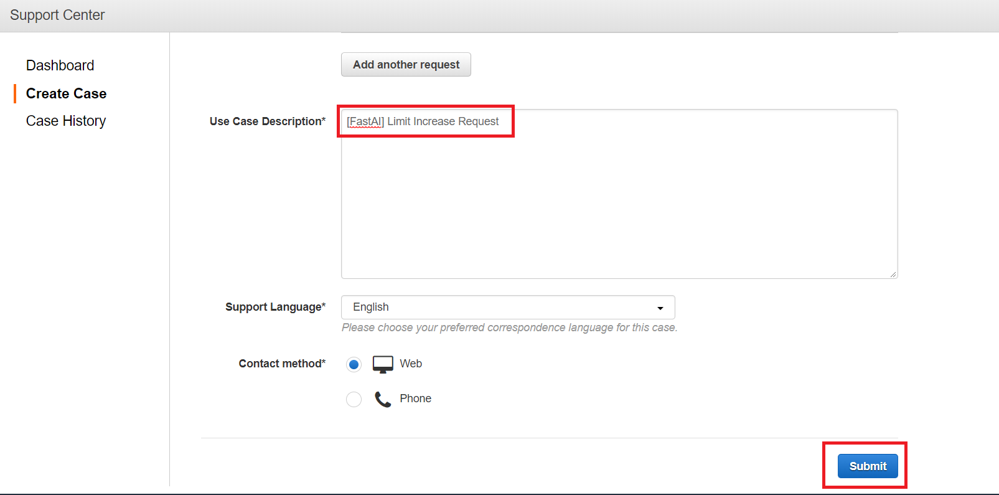
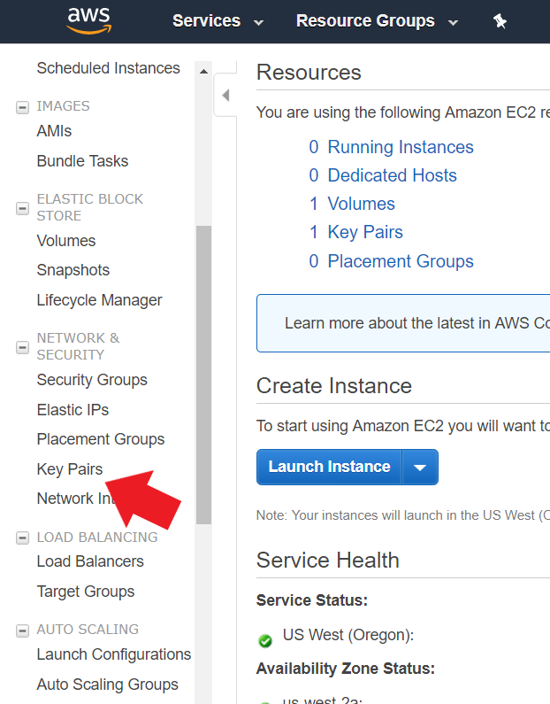
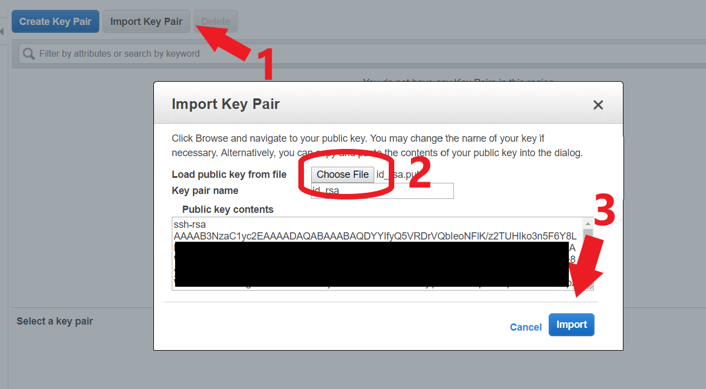
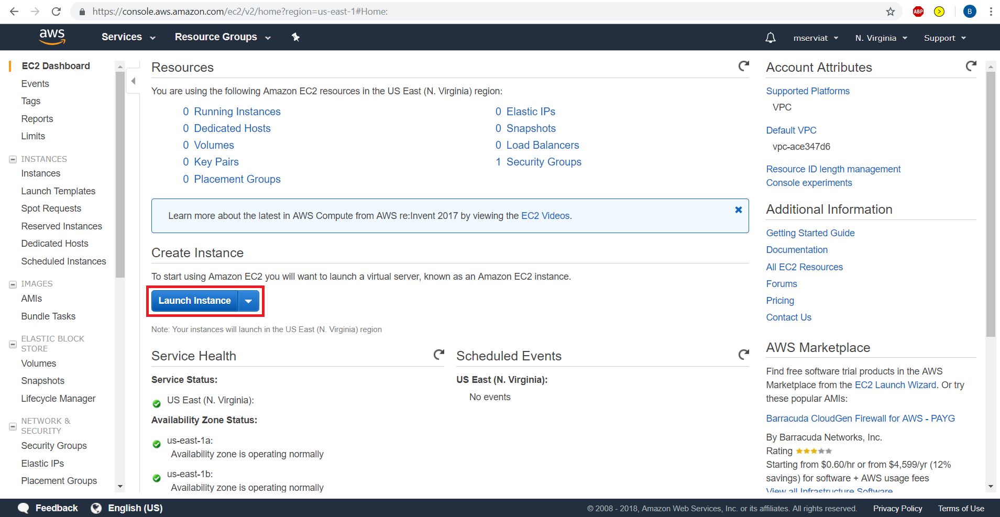

---

title: AWS EC2
keywords: 
sidebar: home_sidebar


---
# Welcome to AWS EC2

AWS EC2 provides preconfigured machine images called [DLAMI](https://aws.amazon.com/machine-learning/amis/), which are servers hosted by Amazon that are specially dedicated to Deep Learning tasks. Setting up an AWS EC2 instance, even with DLAMI, can be daunting. But don't worry, we got you covered. In fact, Amazon has a sweet [step by step guide](https://aws.amazon.com/getting-started/tutorials/get-started-dlami/) to set it up and we are going to draw heavily from their tutorial.

## Pricing
A `p2.xlarge` instance in Amazon which is what we suggest, is [$0.9 an hour](https://aws.amazon.com/ec2/instance-types/p2/).

## Step 1: Sign in or sign up

Visit the [AWS webpage](https://aws.amazon.com/) and click on 'Sign In to the Console'.


If you do not have an account, the button to press will say 'Sign up' instead of 'Sign in to the Console'.


Next, enter your credentials if you are signing in or e-mail, account name and password if you need to sign up. If you are signing up you will also need to set your credit card details. This will be the credit card to which all the charges of the instance usage will be applied (if you have free credits you will not be charged until they are over). Note that you will also need to provide a phone number that will be called to verify your identity.

## Step 2: Request service limit

If you just created your account, you'll need to ask for an increase limit in the instance type we need for the course (default is 0). First click on 'Services' and then 'EC2'.


Then on the left bar, choose Limits, then scroll trhough the list until you find p2.xlarge. You can skip this step if your limit is already 1 or more, otherwise click on 'Request limit increase'.



Fill the form like below, by selecting 'Service Limit Increase', choose 'EC2 instance', your region, then 'p2.xlarge' and ask for a new limit of 1.



Type the message '[FastAI] Limit Increase Request' in the use case description box, then select your preferred language and contact method before clicking 'Sbumit'. You should have an automate reply telling you they'll look in your case, then an approval notice (hopefully in just a couple of hours).



While you wait, get on the second step.

## Step 3: Create an ssh key and upload it to AWS

For this step, you'll need a terminal. This requires an extra installation on Windows which is all described in this [separate tutorial](terminal_tutorial.md).

Once in your terminal, type keygen then press return three times. This will create a directory named .ssh/ with two files in it, 'id_rsa' and 'id_rsa.pub'. The first one is your private key and you should keep it safe, the second one is your public key, that you will transmit to people you want to securely communicate with (in our case AWS).

On Windows, you will need to copy this public key in a Windows directory to easily access it. The following line will copy it in 'C:\Temp', feel free to replace Temp with any directory you prefer.
```
cp .ssh/id_rsa.pub /mnt/c/Temp/
```

Once this is done, go back to the AWS console, click on 'Services' and then 'EC2'.


You can also search for EC2 in the querry bar. Scroll in the left menu until you find 'Key pairs' then click on it.



On the new screen:

1. Click on the 'Import Key Pair' button
2. Browse to select the file id_rsa.pub from where you put it (either the '.ssh' folder of your home directory or the folder to where you copied it)
3. Customize the name of the key if you want, then click 'Import'



## Step 4: Launch an instance

Note that this fail at the end if you didn't get the approval for p2 instances, so you may have to waif a bit before starting this step. 

Log in to the AWS console then search for EC2 in the querry bar or click 'EC2' in the services. Once on the EC2 screen, click launch instance.



Search for 'deep learning' and select the first option: Deep Learning AMI (Ubuntu) Version 16.0


Scroll down until you find 'p2.xlarge' and select it. Then press 'Review and Launch'.


Finally, when in the 'Review' tab press 'Launch'.


In the pop-up window's first drop-down menu, select the key you created in step 2 then tick the box to acknowledge you have access to the selected private key file then click on 'Launch Instance'


## Step 5: Connect to your instance

In the next window scroll down then click on 'View Instances'. You will see that you have an instance that says 'running' under 'Instance State'. Amazon charges you by the amount of seconds an instance has been running so you should **always stop an instance when you finish** using it to avoid getting extra charges. More on this, on Step 7.

Now copy your instance IP in the IPv4 column.


It's time to connect! Open your command line [terminal](terminal_tutorial.md) and type the following command:

```
ssh -L localhost:8888:localhost:8888 ubuntu@<your instance IP>
``` 
(Replace '\<your instance IP\>' with your the IP address of your instance as shown before.)

You may have a question about trusting this address, to chich you should reply 'yes'.

## Step 6: Access fast.ai materials

Run
```
git clone https://github.com/fastai/course-v3
``` 
in your terminal to get a folder with all the fast.ai materials. 

Then run these commands to install the necessary packages for experimenting with fast.ai and PyTorch:

```
conda install -c pytorch pytorch-nightly cuda92
conda install -c fastai torchvision-nightly
conda install -c fastai fastai
```

Next move into the directory where you will find the materials for the course by running:

```
cd course-v3/nbs
```

Finally run
```
jupyter notebook
```
in your terminal, and you can access the notebook at [this page](http://localhost:8888) (localhost:8888).


If it is your first time with Jupyter Notebook, refer to our [Jupyter Notebook tutorial](http://course-v3.fast.ai/dlami_tutorial.html).

If you have any problem while using the `fastai` library try running
```
conda update -all
```

## Step 7: Stop your instance when you are done

When you finish working you must go back to your AWS instance and stop it manually to avoid getting extra charges. A good practice is setting a reminder for yourself (when you close your computer or log off) so you never forget to do it!


If you no longer want to use that instance again, you can just terminate it. This means you will never be able to access the information in it, so be careful. To terminate an instance just choose terminate instead of stop.


## References

https://aws.amazon.com/getting-started/tutorials/get-started-dlami/

---

*Many thanks to Francisco Ingham for writing this guide.*
