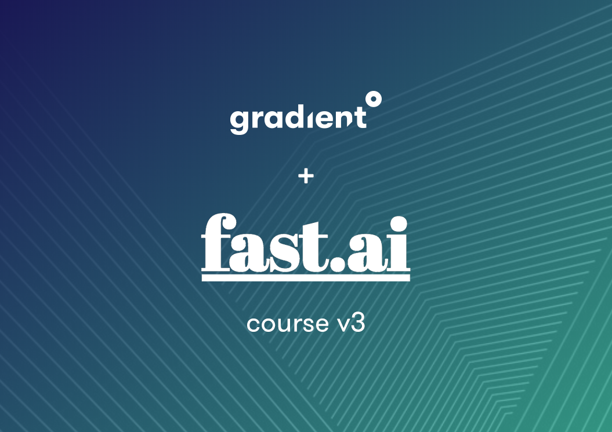
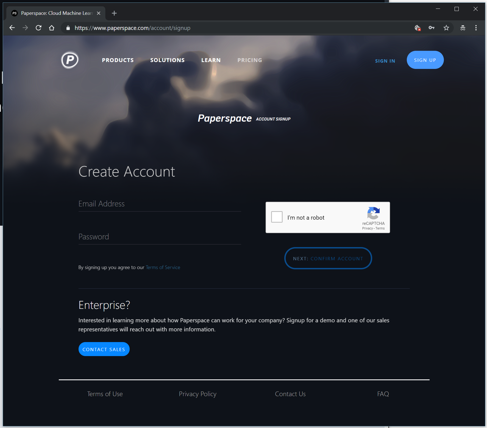
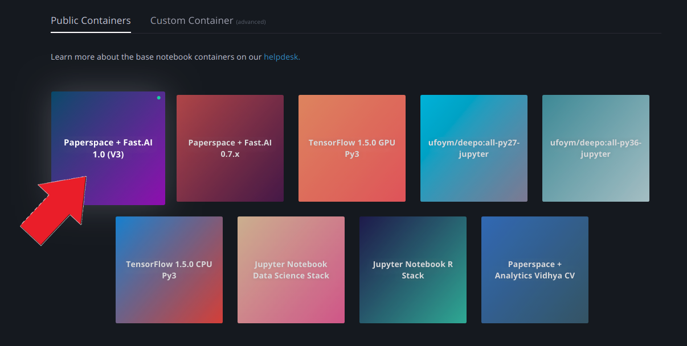
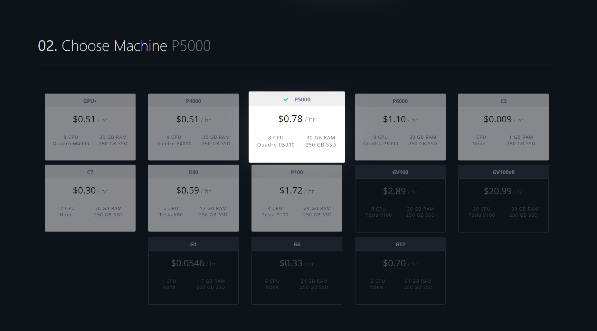
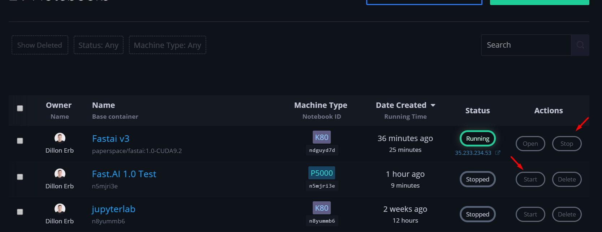
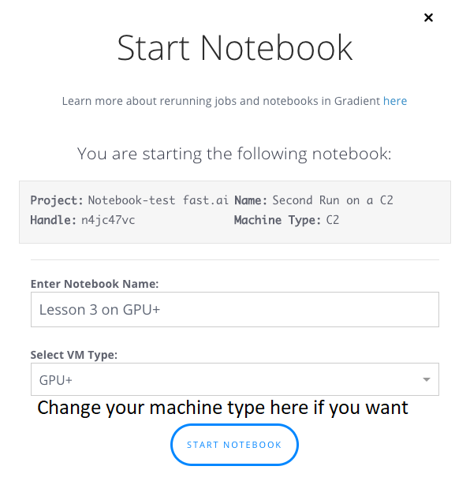

# Welcome to Gradient!

This is a quick guide to starting v3 of the fast.ai course Practical Deep Learning for Coders using Gradient Notebooks. With [Gradient](https://www.paperspace.com/gradient), you get quick access to a Jupyter Lab instance without having to set up a virtual machine or doing any complicated installation or configuration.

[Gradient](https://www.paperspace.com/gradient) is built on top of [Paperspace](https://www.paperspace.com/) is a GPU-accelerated cloud platform. 

## Pricing

The instance we suggest, K80, is [$0.59 an hour](https://support.paperspace.com/hc/en-us/articles/360007742114-Gradient-Instance-Types). There are no storage fees associated with using Gradient Notebooks. The hourly rate is dependent on the Compute Type selected, see all available types [here](https://support.paperspace.com/hc/en-us/articles/360007742114-Gradient-Instance-Types).  Notebooks must be stopped to end billing. Learn more about Gradient billing [here](https://support.paperspace.com/hc/en-us/articles/360001369914-How-Does-Gradient-Billing-Work-).

## Getting Set Up
### Step 1: Create a Paperspace Account
If you haven't already, you'll need to sign up for Paperspace [here](https://www.paperspace.com/account/signup). Confirm your account using the link in the email you receive from Paperspace. [Sign in to Paperspace](https://www.paperspace.com/console/notebooks).

### Step 2: Access Gradient & Create Notebook
I. On the left-hand side of your Console under Gradient, select Notebooks.

II. Select the *Fast.ai 1.0 / PyTorch 1.0 BETA* base container.

**Note: for Pro users, learn more about this docker container at the [paperspace/fastai-docker repo](https://github.com/Paperspace/fastai-docker/tree/fastai/pytorch1.0)**

III. Select your Compute Type.

IV. Name your Notebook.

V. Enter your payment details (if you're new to Paperspace). Even if you have a promo or referral code, all active Paperspace accounts must have a valid credit card on file. You'll be able to enter your promo code later.

VI. Click Create Notebook

When you click Create Notebook, that will start your Notebook and your billing for utilization will begin. To stop billing, you must stop your Notebook. Notebooks will automatically shut down after 12 hours.

You'll be taken to your Notebook details page in your Console, where your Notebook will be created. It will go straight from Pending to Running, and will be ready to use :star2:.

### Step 3: Stopping your Notebook
Under Action, just click stop.  This will end the billing session.

 **NOTE: you *will* be charged for the time that your notebook is running. You must stop the notebook to stop incurring charges**

### Step 4: Restart your Notebook
Click Start to pick up where you left off, and/or choose a different VM type on which you'd like to run your Notebook. This can be extremely useful when you want to start on a lower-end machine type and then move to a more powerful GPU. Also, sometimes the GPU type that you started the notebook on will be unavailable, in which case you can easily fire it up on a different GPU.

## Managing Data
Fast.ai data files (dogscats) can be found in the 'datasets' folder. Files in this directory are hosted by Paperspace and are read-only. See [Public Datasets](https://support.paperspace.com/hc/en-us/articles/360003092514-Public-Datasets) for more info.

The `storage` folder is your [Persistent Storage](https://support.paperspace.com/hc/en-us/articles/360001468133-Persistent-Storage). Files placed here are available across runs of Paperspace Jobs, Notebooks, and Linux machines. Empty by default, this repository is meant to store training datasets.

The rest of the files in the notebooks directories will be available as Artifacts when your notebook is stopped.

## Wrapping up
Paperspace provides $10 of Gradient credit to start you off on your course. This code is to be used for fast.ai students only. In your console, click on Billing in the left-hand menu and enter the promo code at the bottom right. The promo code for this course is: **FASTAIGR45T**.

Note: If you opt for a Gradient 1 Subscription, promotional credit does not apply. [Learn more about Gradient Subscription levels here](https://support.paperspace.com/hc/en-us/articles/360002068913-Gradient-Subscriptions).

Questions or issues related to course content, we recommend posting in the [fast.ai forum](http://forums.fast.ai/).

For Paperspace-specific support, check out the rest of the Gradient Help Center or submit a support ticket with [this form](https://support.paperspace.com/hc/en-us/requests/new).

---

*Many thanks to Dillon Erb for writing this tutorial*
