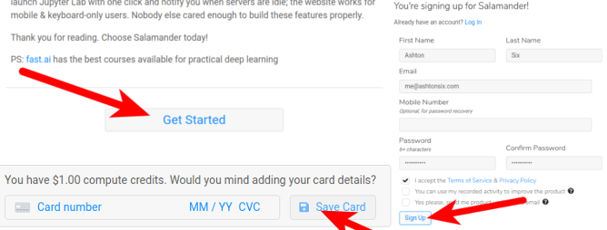

---

title: Salamander
sidebar: home_sidebar

---

# Welcome to Salamander!

Your Salamander instance comes with fastai V1, PyTorch 1.0 and all fast.ai course materials out of the box.

## Pricing

#### Prices per GPU

Telsa K80: $0.36 per hour

Tesla V100: $1.29 per hour

#### Important considerations

- You only pay for hardware when your server is turned on
- Salamander's compute charge tracks the AWS spot price (+26%, and it picks the best availability zones to improve uptime / cost)
- You keep paying for storage until you destroy a server

## Step 1: Create an account

Go to https://salamander.ai and click on 'Get Started'. Enter your email & password and click "Sign Up". Finally, add your credit card details and you are done!

## Step 2: Create your server

First you need to accept the CuDNN license & acknowledgements. Next, pick your software, hardware & storage size (if you do not know what to choose, just keep the default options). To start your server click "Launch Server". The server will take about 1 minute to start up. 

## Step 3a: Connect to your server via terminal

To connect first click "Setup Access Key" and generate or upload a key (for more info on generating ssh keys refer to [here](https://confluence.atlassian.com/bitbucketserver/creating-ssh-keys-776639788.html)). This key will be added to all of your servers. Copy & paste `ssh ubuntu@[xxx.xxx.xxx.xxx]`  from the webpage into your terminal and run it. You have accessed your server!

## Step 3b: Access Jupyter Lab via webpage

When the server is up and running you will be able to click on 'Jupyter Lab'. Navigate to your desired folder (e.g. ''~/fastai-courses/course-v3'). Open a notebook, & select the 'fastai' kernel ('fastai-0.7' for v2 course). You're up! If its your first time with Jupyter Notebooks please refer to our [Jupyter Notebooks tutorial](http://course-v3.fast.ai/notebook_tutorial.html).

## Step 4: Stop your server when you are not using it

Remember to stop your server when you are not using it! You can do this in the webpage. Once stopped, you can replace your server's hardware and / or increase the storage size by clicking 'Modify'.
